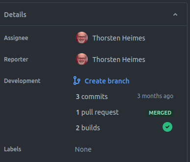

# Git

Ein git Repository ist aus praktischer Sicht eine Abfolge von aufgezeichneten
Zuständen eines Ordners mit Textdateien 

> wobei vorrangig Softwareprogramme verwaltet werden ;-)

## Commit

Ein `commit` speichert grundsätzlichen einen Zustand aller Dateien eines Ordners.

Sollen Dateien ignoriert werden, sind entsprechende Einträge in der Datei [`.gitignore`](https://git-scm.com/docs/gitignore)
zu hinterlegen.

Beispiel:

```
# wild-card
*.py[cod]

# einzelne Dateien order Ordner
.Python
build/
```

## Repository clonen

```shell
git clone <remote url>
```

Legt im aktuellen Ordner einen Unterordner mit den Dateien des Repositories an.

## Änderungen vornehmen

Geänderte Dateien mit `git add <FILE_PATH>` in der Versionsverwaltung vormerken
und mit `git commit` speichern.

Dabei öffnet  sich ein Editor, damit eine Beschreibung des commits eingegeben wird.
Diese ist zwingend, d.h. eine leere Beschreibung bricht den Commitvorgang ab.

### Commit message

Je nach Grad der Zusammenarbeit im Team, sollte die Commitbeschreibung eine
kurze und prägnante Zusammenfassung der vorgenommenen Änderungen enthalten.

Wie es nicht geht: [tutorial](https://www.linkedin.com/pulse/how-write-very-bad-commit-messages-ran-bar-zik), [whatthecommit](https://whatthecommit.com/), [codelord](https://www.codelord.net/2015/03/16/bad-commit-messages-hall-of-shame/)

Ein pragmatischer Ansatz ist auf [dev.to](https://dev.to/thawkin3/how-to-write-awful-commit-messages-and-good-ones-too-1f8m)
beschrieben.

## Branches

Ein `Branch` ist ein benannter `commit`.

```shell
git checkout -b <branch-name>
```

Wenn der Name des Branches mit `feat/` beginnt und die Jira Ticketnummer folgt (z.B. `DATA-42`),
werden Information zum Entwicklungsfortschritt im Ticket angezeigt.



## Synchronisierung mit `remote`

```shell
git fetch [--all]
```

Mit der Option `--all` werden Informationen über alle Branches abgeholt.

Hilfreich um zu sehen, ob eventuell ein Kollege bereits einen neuen Branche
für ein Ticket angelegt hat.

### Pull

Schreibt die Änderungen des `remote` Branches in die lokale Kopie.

Dabei können Konflikte auftreten, weil Änderungen von `remote` mit
lokalen Änderungen kolidieren.

In diesem Fall hilft ```git stash``` womit die aktuellen Änderungen in einen
*quasi* Branch geschrieben werden. 

Einzelne stashes werden nach dem Muster `stash@{<NUMMER>}` referenziert.

Nützliche commands sind:

- `git stash list` zum Auflisten aller stashes.
- `git stash pop stash@{0}` zum Anwenden der im stash gespeicherten Änderungen und anschließendem Löschen des stashes.
- `git stash drop stash@{0}` zum Löschen eines stashes.

### `Merge` Konflikte

Wichtigste Regel: *Don't panic*.

1. Das lokale Repository aktualisieren.
1. Zum zu mergenden Branch wechseln und den Konflikt-Branch (also `main` oder `develop`)
   in diesen mergen.
   ```shell
   git merge main
   ```
1. Die Konflikte in `Visual Studio Code` lösen. Der merge-Editor bietet dazu eine
   transparente Ansicht.
1. Die Änderungen in den remote Branch pushen.

### Push

Beim pushen eines branches wird der lokale branch nicht mit `remote` verknüpft.

D.h. weitere `push` oder `pull` laufen ins leere.

```shell
$ git push origin feat/updated 

$ git pull
There is no tracking information for the current branch.
Please specify which branch you want to merge with.
See git-pull(1) for details.

    git pull <remote> <branch>

If you wish to set tracking information for this branch you can do so with:

    git branch --set-upstream-to=origin/<branch> feat/updated
```

Ein `push` ohne verknüpften `remote` branch gibt einen freundlichen Hinweis,
was zu tun ist, um das Probelem zu beseitigen.

```shell
$ git push
fatal: The current branch feat/updated has no upstream branch.
To push the current branch and set the remote as upstream, use

    git push --set-upstream origin feat/updated
```

## Diff

Struktur

```shell
git diff commit#1..commit#2
```

## `Merge` | `Rebase` | `Squash` Strategie

Letzlich ist `merge` die sicherste Strategie. Nachteilig ist das Aufblähen der Commit Historie,
was bei sehr großen Repositories (z.B. Linux) zu Problemen führen kann in unserer alltäglichen
Arbeit jedoch kaum eine Rolle spielt (sh. [Offizielle `merge` Doku](https://git-scm.com/docs/git-merge)).